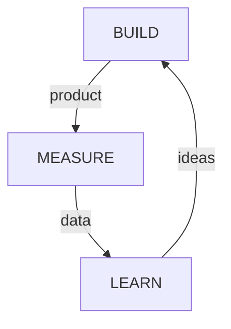

# The Lean Startup

by Eric Ries (1st Edition, 2011)
 
## Synopsis:

***The Lean Startup*** is an excellent primer into the world of applying the scientific method to innovate/iterate/evaluate business products/procedures/progress.  While the title may lead one to believe this book was written exclusively for startups, its content are applicable to anyone looking to either introduce disruptive innovation (new products/services, actual startups, etc) **OR** sustaining innovation (established companies, products, etc). ***The Lean Startup*** It is by no means a prescriptive cookbook, but rather a framework on the how and what of working towards an ultimate outcome (vision) through constantly evolving strategy through optimization ("tuning the engine").  It's methods do not work in absolutes, nor should it, but the conceptually approach that should be taken, custom tailored for a given desired outcome within the given circumstances the startup finds itself in. 

Ries presents this in what he termed "the Build-Measure-Feedback Loop", a modern interpretation geared towards business/product innovation.  Ries' core approach is not groundbreaking, even by the author's own admission, it is roughly applying the same fundamental principles of [the scientific method](https://en.wikipedia.org/wiki/Scientific_method).  The goal of both remain the same, minimize the time through the loop by employing "innovation accounting (establish an MVP, defining how/what to measure to decide if you're making progress (actionable/accessible/auditable metrics, identify & avoid "vanity metrics" at all costs as they are misleading), testing/iterating using what you've learned in previous cycles through the same loop (validated learning), and deciding if/what to change each time (pivot/persevere).  It is important to understand that a "pivot" is not a full overhaul, but an iterative change that helps you achieve the outcome (vision), regardless of the output. 

We are then introduced to the optimization(s) that can be gained by implementing the early concepts and that can be applied as part of a "lean transformation" to a more adaptive organization.  One must be able to identify the activities that are value-creating and those that value-destroying, to leverage the power of small batches (e.g. cicd), mindful planning (which occurs in the opposite order of the Build-Learn-Measure feedback loop), and practices/approaches that can assist in root-cause analysis (e.g the 5 Whys/Blames) and correction.

 

Ries then lays out the environment he believes to be necessary for a startup team to thrive in an established company (scarce/secure resources, independent authority/autonomy to develop their "business", a personal stake in the outcome).   Cross-functional teams, as in a team that has full-time representation from every functional department in the company that will be involved in the creation/launch of the envisioned outcome, are **HIGHLY** encourage (this is where the silo/ivory tower approaches can not scale innovation outside of their sphere of influence/control). A sandbox where a team can test/experiment/measure full end-to-end small batches is a key to success. Senior management/leadership is responsible for creating/protecting the conditions that will enable employees to work in the manner startup teams/entrepreneurs require.

 

I feel the author walked the reader through invaluable tools that can be employed at both an individual and group (team, company/government) levels to better identify problems worth solving, how to understand if we are making progress in solving them, and how complex problems are more efficiently solved through thoughtful/controlled iteration rather than all at once, but only once.   He also outlines the environments that this type of testing/innovation can best thrive, some common misconceptions/pitfalls we could encounter along the way, as well as lessons from the past (failures, successes, and origins of some of the foundational concepts presented).  This book provides inspiring methodology for those looking increase their chances of success as an entrepreneur through continuous improvement practices (build-measure-learn feedback loop, MVP, innovation accounting, auditable/actionable/accessible metrics, etc), and being honest about what is actually working/creating value and when it is time to pivot.

 

---

# NOTES

## VISION

- Vision : p22 : "true north" of a startup, the destination

- Strategy : p22 : used to achieve vision

     - business model

     - product road map

     - POV about partners and competitors

     - ideas about who customer will be

- Product : p23 : the end result of a strategy

     - change constantly through process of optimization, or "*tuning the engine*"

 

### DEFINE

- Startup : p27 : a human institution designed to create a new product/service under conditions of uncertainty

- sustaining innovation : p31 : incremental improvements to existing products and serving existing customers

- disruptive innovation : p31 : new, breakthrough products/services

 

> "...cultivating entrepreneurship is the responsibility of senior management" (pg31)

 

> "Leadership requires creating conditions that enable employees to do the kinds of experimentation that entrepreneurship requires" (pg35)

 

### LEARN

- Learning : pg38 : Learning is vital in order to learn the truth about which elements of a strategy are working (or not working) towards the realization of the vision.

- learn what customer *really* want, not what they say they want or what we think they should want

- validated learning : pg38 : the process of demonstrating **empirically** that a team has discovered valuable truths about a startup's present and future business prospects.

 

> "the lethal problem of achieving failure: successfully executing on a plan that leads nowhere" (pg38)

 

- Metcalfe's Law : the value of a network as a whole is proportional to the square of the number of participants

 

- Value vs Waste : pg47 : which efforts are value-creating and which are wasteful

     - value : that which provides benefit to the customer

     - waste : everything else that is not absolutely necessary for learning/delivering what customers want

 

### EXPERIMENT

> "if you cannot fail, you cannot learn." (pg56)

 

- Value Hypothesis : pg61 : tests whether a product/service really delivers value to customers once they are using it

 

- Growth Hypothesis : pg61 : tests how customers will discovers in a product/service; measures behavior

 

- Identify the elements of the plan that are *assumptions rather than facts*, and figure out ways to test them (pg69)

 

---

## STEER

 

### Leap

- Feedback :

     - qualitative : what people like/don't like

     - quantitative : how many people use it and find it valuable

 

- Build-Measure-Learn feedback loop : pg75 : the goal is to minimize time through the loop (pg75)

 

 

- The role of strategy is to help figure out the right questions to ask. (pg81)

 

- The first step in understanding a new product/service is to figure out if it is fundamentally value-creating or value-destroying (pg85).

 

- ***genchi genbetsu*** (pg86): "go and see for yourself" (pg86)

     - to go and see the location or process where the problem exists in order to solve that problem more quickly and efficiently. To grasp problems, confirm the facts and analyze root causes.

 

- customer archetype (pg89):  brief document to humanize proposed target customer

     - based in hypothesis, not fact

    

### TEST

 

- Minimum Viable Product (MVP) : pg107

     - starts the process of learning as quickly as possible

     - fastest way to get through Build-Measure-Learn loop with minimum effort

     - remove any feature/process/effort that does not contribute directly to learning what you seek (110)

 

- If we do not know who the customer is, we do not what quality is (pg107).

 

- The ONLY way to win is to learn faster than anyone else. (111)

 

### MEASURE

 

- Innovation accounting (117):

     1. use MVP to establish real data on where the company is right now

     2. "tune engine" from baseline to ideal

     3. make pivot or persevere decision

    

- A good design is one that changes a customer's behavior for the better. (120)

 

- If we're not moving the drivers of our business model, we're not making progress == time to pivot (120)

 

- Successful pivot : new experiments are overall more productive than previous experiments (125)

 

> "That which optimizes one part of the system necessarily undermines the system as a whole." (135)

 

- The 3 A's of Metrics : 143

     1. Actionable : must demonstrate clear cause-and-effect

     2. Accessible : simple reports using tangible/concrete units and must be available/accessible to all

          - cohort-based reports : complex actions --> people-based reports

     3. Auditable : traceable/credible to employees

    

### PIVOT (OR PERSEVERE)

 

- Pivot (149) : a structured course correction designed to test a new fundamental hypothesis about product, strategy, and engine of growth

     > "...there is no bigger destroyer of creative potential than the misguided decision to persevere. Companies the cannot bring themselves to pivot to a new direction on the basis of feedback from the marketplace can get stuck in the land of the living dead, neither growing enough nor dying, consuming resources and commitment from employees and other stakeholders but not moving ahead." - pg149-150

 

- The goal of creating learning milestones is not to make the decision easy; it is to make sure that there is is relevant data in the room when it comes time to decide. (153)

 

- The more money, time, and creative energy that has been sunk into an idea, the harder it is to pivot. (153)

 

- Failure is a prerequisite to learning. (154)

 

- Reasons why pivots that **need** to happen, don't happen sooner (161):

     1. Vanity metrics can allow entrepreneurs to form false conclusions and live in their own private reality. (161) This is particularly damaging to the decision to pivot b/c it robs teams of the belief that it is necessary to change.

 

     2. When an entrepreneur has an unclear hypothesis, it's almost impossible to experience complete failure, and without failure there is usually no impetus to embark on the radical change a pivot requires. (160)

 

     3. Fear - acknowledging failure can lead to dangerously low morale.   Most entrepreneurs' biggest fear is that their vision might be deemed wrong prematurely (without having been given a real chance to prove itself)

    

- Telltale signs of a need to pivot (164):

     1. the decreasing effectiveness of product experiments (diminishing returns)

     2. the general feeling that product development should be more productive

    

- Types of Pivots (172):

     - Zoom-In : a single feature in a product becomes the whole product

     - Zoom-Out : a single feature is insufficient to support a whole product

     - Customer Segment : the product being built solves a real problem for real customers but that they are not the type of customers it originally planned to serve

     - Customer Need : the target customer has a problem worth solving, just not the one that was originally anticipated

     - Platform : a change from application to a platform or vice versa

     - Business Architecture : high margin, low volume (complex systems model)<--> low margin, high volume (volume operations model)

     - Value Capture : changes to the way a company captures value

     - Engine of Growth : a company changes its growth strategy to seek faster or more profitable growth

     - Channel : as recognition that the same basic solution could be delivered through a different channel with greater effectiveness

     - Technology : a company discovers a way to achieve the same solution by using a completely different's technology

    

---

## Accelerate

### Start Your Engines

- The critical first question for any lean transformation is : which activities create value and which are a form of waste

 

### Batch

 

- batch size : how much work moves from one stage to the next at a time (184)

 

- in process-oriented work, individual performance is not as important as overall performance of the system (185)

 

- every investment in better tools and process had a corresponding benefit in terms of shrinking batch size of work (187)

 

- biggest advantage of working in small batches is that quality problems can be identified much sooner (187)

 

- Andon cord (187) : cord used to halt the flow of an entire system

     - benefits of finding and fixing problems faster outweigh the cost of halting production b/c defects are continuously identified/addressed

 

- Lean Startup goal is NOT to produce more stuff efficiently, but learn how to build a sustainable business as quickly as possible. (188)

 

- the key to being able to operate [this] quickly is to check for defects immediately, thus preventing bigger problems later (automated testing) (189)

 

- Planning works in reverse order of the Build-Learn-Measure feedback loop (201-202)

     1. figure what needs to be learned

     2. see what products will work as an experiment to start learning

     3. hypothesis about customer pulls work from product development an other functions

    

- Three Engines of [Sustainable] Growth (212)

     1. Sticky :

          - churn rate : the fraction of customers in any period who fail to remain engaged with a company's product

          - if the rate of new customer acquisition exceeds the churn rate, the product will grow

          - the speed of growth is determined by the rate of compounding - the natural growth rate minus the churn rate

     2. Viral:

          - how many customers will a customer bring with them?

     3. Paid:

          - rate of growth increased by either increasing revenue from each customer OR drive down cost of acquiring a new customer

 

### Adapt

 

- adaptive organization : an organization that automatically adjusts it process and performance to current conditions (227)

 

> "Stop production so that production never has to stop." pg227

 

- The key to the *Andon cord* is that it brings work to a stop as soon as an uncorrectable problem surfaces - which forces it to be investigated.

 

- you cannot trade quality for time - quality problems now will result in defects later and slow you down even more - defects = a lot of rework, low morale, and customer complaints (227)

 

- **The Five Whys** (pg229):

     - investigative method to follow path to root cause by asking "Why?" five times (230)

     - core idea is to tie investments directly to the prevention of the most problematic symptoms (230)

     - consistently make a proportional investment at each of the five levels of "why" hierarchy (minor symptom = small investment; major symptom = big investment)

     - ties the rate of progress to learning, not just execution

     - we want to have a systems-level view as much as possible

     - requires an environment of mutual trust and empowerment (236)

    

- as investments in infrastructure or process pay off, the severity and number of crises are reduced and the team speeds up again

 

- **Curse of the Five Blames** (pg234)

     - a trap teams a can fall into when using the 5 Whys to assign blames instead of finding?fixing problems

 

> "If a mistake happens, shame on us for making it so easy to make that mistake." pg235

 

- Getting Started (simplified implementation to build familiarity/sympathy - does NOT work/scale effectively in the longterm): 236

     1. be tolerant of all mistakes the first time (most mistakes are caused by flawed systems, not bad people)

     2. never allow the same mistake to to be made twice (gets team started making proportional investments in prevention)

    

- You will need to be prepared for the fact the "Five Whys" is going to turn up unpleasant facts about your organization, especially in the beginning. (231)

 

- Teams may feel that they don't have enough time to waste on analyzing root causes even though it would give them more time in the long term. (231)

 

- Building an adaptive organization requires executive leadership to sponsor and support the process (231)

 

- Start with a narrowly targeted class of symptoms.

 

- Do not send endemic/existing problems (aka baggage) through the Five Whys, only as new problems come up (240)

 

- Organizations have "muscle memory", it is hard for people to unlearn old habits (248)

 

### Innovate

- Startup teams require (253):

     1. scarce but secure resources

     2. independent authority to develop their business

     3. a personal stake in the outcome

    

- Recommended that startup teams be completely cross-functional, e.g. have full-time representation from every functional department in the company that will be involved in creation of creation/launch of early products. (255)

 

- Handoffs and approvals slow down the Build-Measure-Learn feedback loop and inhibit both learning and accountability. (255)

 

- Parent organization has to make it clear who the innovator(s) is/are and make the the innovator(s) receive credit for having brought the new product to life (if successful) - creating a sense of ownership/stake in the product (255)

 

- Teams that have little confidence that they will receive any long-term ownership of their innovations are rarely motivated to take real risks and end up focusing on projects/initiatives that are most likely to win the approval of senior management. (256)

 

- Innovation Sandbox (261):

     - require reporting on the success/failure by using actionable metrics and innovation accounting

     - productivity should be measured by ability to create customer value, not just to stay busy

     - experiments are easy to classify as successes/failures b/c top-level metrics either move or they don't

     - using the same metrics each time builds literacy about the metrics across the company

     - sandboxes promote rapid iteration b/c projects can be seen through end-to-end in small batches and deliver clear verdicts/metrics

     - mistakes are cheap and revealed faster

 

- every new innovation competes for resources with established projects, including one of the scarcest resources, talent (266)

 

- you will need to be able to predict the outcome of the changes you make to tell if the problems that result are really problems (270)

 

- we want to force teams to work cross-functionally to achieve validated learning via actionable metrics, continuous deployment, and the overall Build-Measure-Learn feedback loop (271)

 

- switching to validated learning feels worse before it feels better b/c the problems caused by the old system tend to be intangible, whereas the problems of the new system are all too tangible (271)

     - loss of productivity is an inevitable part of the transition, can be managed actively and expectations can be set up front

 

- The Lean Startup approach is NOT a defined set of steps or tactics (270)

     - it is framework (271)

     - designed to be adapted to the conditions of each specific company  (271)

 

### Epilogue : Waste Not

 

- our productive capacity greatly exceeds our ability to know what to build (273)

 

- waste is not a result of inefficient organization of work, but from working on the wrong things (274)

 

> "There is surely nothing quite so useless as doing with great efficiency what should not be done at all." - Peter Drucker (274)

 

- most forms of waste in innovation are preventable once their causes are understood (275)

 

- current problems are caused by trying too hard at the wrong things (275)

 

- the real goal of innovation : the learn that which is currently unknown (275)

 

- what matters is not setting quantitative goals, but fixing the method by which those goals are attained (275)

 

- Achieve better results systematically by changing belief about how innovation happens (276)
